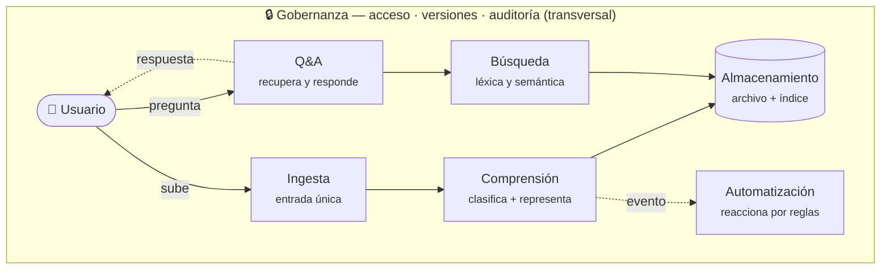
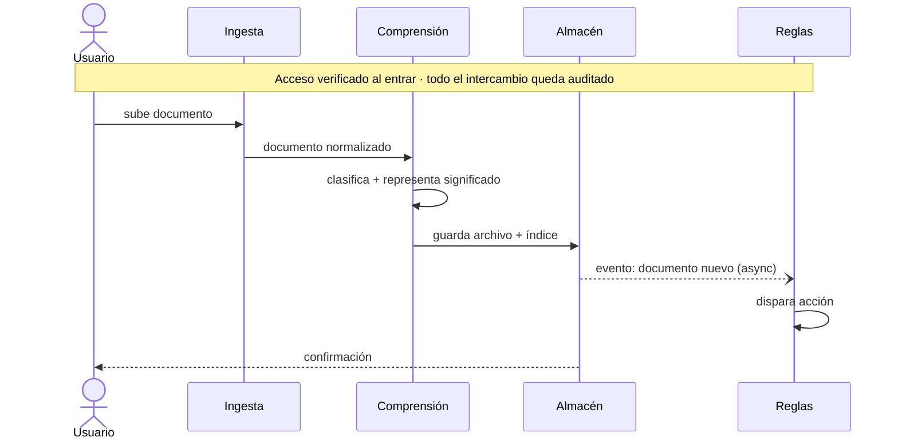
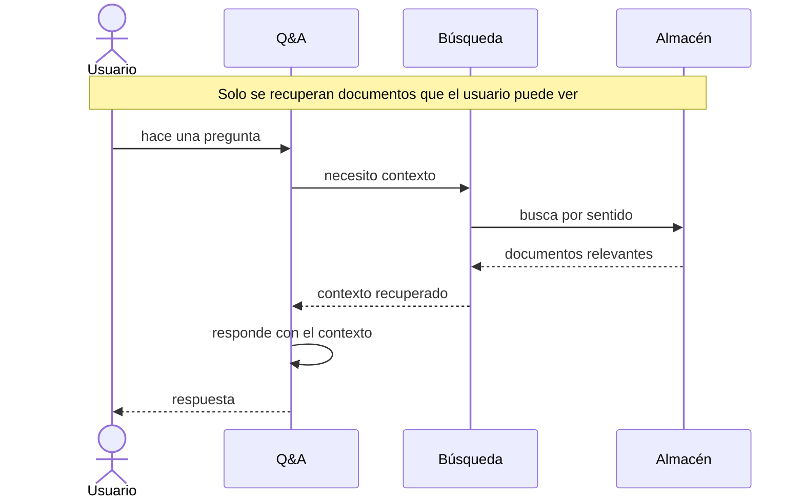

# Stackd AI 📂⚡
> Una propuesta conceptual de gestión documental impulsada por IA para PYMEs y equipos en crecimiento.

> [!NOTE]
> Este documento describe una de un modelo conceptual de lo que se puede construir con IA aplicada a la gestión documental. No es un producto implementado ni un repositorio en desarrollo. El aporte es el **modelo de arquitectura** —cómo separar las responsabilidades del sistema— no un software terminado.

---

## 🚀 ¿Qué es Stackd?

**Stackd** propone una plataforma de gestión documental impulsada por IA, pensada para PYMEs y emprendedores que hoy se pierden entre archivos, carpetas y el caos. La idea central: convertir el desorden documental en un flujo de trabajo inteligente, buscable y automatizado.

Lo que distingue a la propuesta no es *guardar* documentos, sino agregarles una **capa de significado**: que el contenido se vuelva consultable y respondible, no solo almacenable. Sin esa capa, el sistema sería un Dropbox con buscador. Con ella, es un sistema que entiende lo que guarda.

---

## 🎯 El Problema

- Documentos dispersos entre correo, Drive, Dropbox y WhatsApp
- Horas perdidas buscando contratos, facturas e informes
- Sin control de versiones, sin historial, sin trazabilidad
- Las herramientas existentes están hechas para grandes empresas, no para este segmento

---

## ✅ La Propuesta

El modelo plantea llevar la IA a la capa documental para que el sistema pueda:

- 📥 **Capturar** — Recibir o conectar documentos desde cualquier fuente
- 🧠 **Comprender** — Leer, clasificar y representar el significado del contenido
- 🔍 **Encontrar** — Buscar por contenido y por sentido, no solo por nombre de archivo
- ⚙️ **Automatizar** — Disparar flujos de trabajo según el tipo o contenido del documento
- 🔒 **Proteger** — Historial de versiones, control de acceso y registros de auditoría

---

## 🏛️ Arquitectura Conceptual

> **Principio rector:** una lista de funcionalidades y una arquitectura no son lo mismo. La funcionalidad dice *qué hace* el sistema; la arquitectura dice *cómo se reparten las responsabilidades* para lograrlo. El aporte de esta propuesta es esa separación: desacoplar capacidades que intuitivamente vienen mezcladas, porque cada responsabilidad separada es una pieza que se puede razonar, probar y evolucionar por su cuenta.

### Componentes lógicos

El sistema se organiza en siete componentes. Seis participan del recorrido de un documento; **Gobernanza** es transversal: envuelve a todos, no es un paso.

| Componente | Responsabilidad | Qué separa que antes venía fundido |
|---|---|---|
| **Ingesta** | Frontera de normalización: convierte orígenes distintos (Drive, correo, WhatsApp) en "un documento del sistema". | Aguas abajo deja de importar de dónde vino el documento. |
| **Comprensión** | Lee el documento y produce dos salidas: una **clasificación** (*qué es*) y una **representación de significado** (consultable por sentido). | Clasificar y representar son capacidades distintas; fundidas, la búsqueda semántica no tiene sobre qué operar. |
| **Almacenamiento** | Guarda dos cosas de naturaleza distinta: el **archivo original** (inmutable, se descarga entero) y el **conocimiento derivado** (índice, se consulta y se recalcula). | "Subir y guardar" ocultaba que son dos ciclos de vida diferentes. |
| **Búsqueda** | Recupera documentos combinando dos modos: **léxico** (palabra exacta) y **semántico** (sentido). | Cada modo cubre lo que el otro falla: léxico encuentra "factura 4417"; semántico encuentra "el contrato de alquiler" aunque el doc no use esa palabra. |
| **Q&A** | Responde preguntas **desde** los documentos recuperados, no desde el conocimiento general del modelo. | La regla *recuperar-antes-de-responder* es la línea entre "responde sobre tus documentos" e "inventa". |
| **Automatización** | Motor que observa eventos y **reacciona de forma asíncrona** según reglas ligadas al tipo o contenido. | El usuario que subió el documento no espera a que se dispare nada. |
| **Gobernanza** | Propiedad transversal: cada búsqueda respeta permisos, cada recuperación se filtra por acceso, cada acción se audita. | Sube de "feature" a *propiedad del sistema* que envuelve cada operación. |

### Diagrama de componentes

### Flujo 1 — Ingesta de un documento

Un documento entra y queda guardado junto con lo que el sistema entendió de él. La verificación de acceso ocurre al entrar; Automatización reacciona de forma asíncrona (no bloquea al usuario).

### Flujo 2 — Consulta y respuesta

La regla que da fidelidad al sistema: **primero se recupera, después se responde**. Q&A no contesta de memoria; contesta a partir de los documentos que Búsqueda trajo, filtrados por lo que el usuario tiene permiso de ver.

---

## 🧩 Capacidades Propuestas

| Capacidad | Descripción |
|---|---|
| Carga Inteligente | Al recibir un archivo, la IA lo clasifica automáticamente |
| Búsqueda con IA | Recuperación por contenido, combinando modo léxico y semántico |
| Etiquetado Automático | Contratos, facturas, informes — etiquetados por el sistema |
| Disparadores de Flujo | "Cuando se recibe una factura → notificar al contador" |
| Colaboración en Equipo | Compartir, comentar y aprobar documentos de forma conjunta |
| Integraciones | Conexión con fuentes como Google Drive, Dropbox, Gmail o WhatsApp |

---

*Stackd — una exploración de lo que la IA puede aportar a la gestión documental.*
